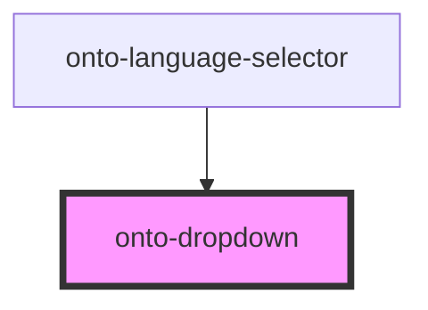

# ontotext-yasgui-dropdown

<!-- Auto Generated Below -->

## Properties

| Property          | Attribute           | Description | Type               | Default     |
| ----------------- | ------------------- | ----------- | ------------------ | ----------- |
| `iconClass`       | `icon-class`        |             | `string`           | `''`        |
| `items`           | --                  |             | `DropdownOption[]` | `undefined` |
| `nameLabelKey`    | `name-label-key`    |             | `string`           | `undefined` |
| `tooltipLabelKey` | `tooltip-label-key` |             | `string`           | `undefined` |

## Events

| Event          | Description | Type               |
| -------------- | ----------- | ------------------ |
| `valueChanged` |             | `CustomEvent<any>` |

## Dependencies

### Used by

 - [onto-language-selector](../../onto-language-selector)

### Graph

----------------------------------------------

*Built with [StencilJS](https://stenciljs.com/)*
