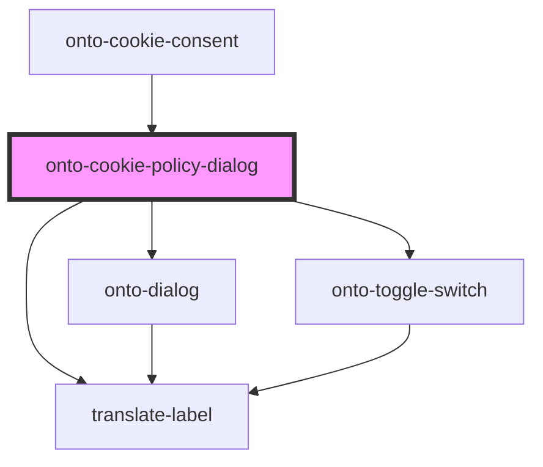

# onto-cookie-dialog

<!-- Auto Generated Below -->

## Events

| Event         | Description                                                                               | Type                |
| ------------- | ----------------------------------------------------------------------------------------- | ------------------- |
| `closeDialog` | Event emitted when the dialog is closed, allowing parent components to react accordingly. | `CustomEvent<void>` |

## Dependencies

### Used by

 - [onto-cookie-consent](../../onto-cookie-consent)

### Depends on

- [onto-dialog](..)
- [translate-label](../../translate-label)
- [onto-toggle-switch](../../onto-toggle-switch)

### Graph

----------------------------------------------

*Built with [StencilJS](https://stenciljs.com/)*
