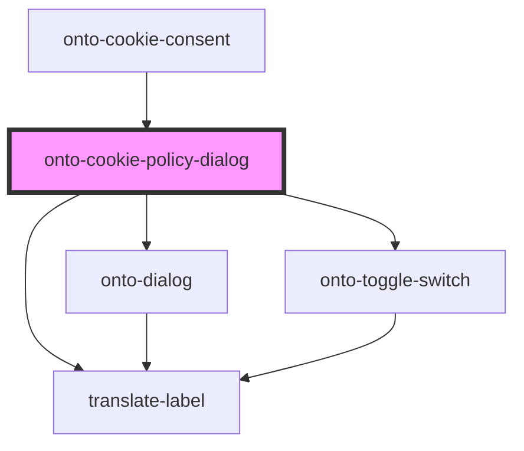

# onto-cookie-dialog

<!-- Auto Generated Below -->

## Properties

| Property                     | Attribute        | Description                                            | Type            | Default     |
| ---------------------------- | ---------------- | ------------------------------------------------------ | --------------- | ----------- |
| `dialogHandler` _(required)_ | `dialog-handler` | The dialog handler for managing the dialog's behavior. | `DialogHandler` | `undefined` |

## Dependencies

### Used by

 - [onto-cookie-consent](../../onto-cookie-consent)

### Depends on

- [onto-dialog](..)
- [translate-label](../../translate-label)
- [onto-toggle-switch](../../onto-toggle-switch)

### Graph

----------------------------------------------

*Built with [StencilJS](https://stenciljs.com/)*
