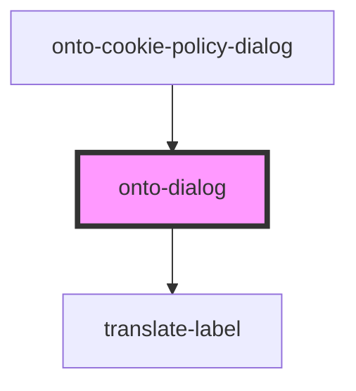

# onto-dialog

<!-- Auto Generated Below -->

## Properties

| Property | Attribute | Description                          | Type                                                                            | Default     |
| -------- | --------- | ------------------------------------ | ------------------------------------------------------------------------------- | ----------- |
| `config` | `config`  | Configuration object for the dialog. | `{ dialogTitle: string; onClose: (evt: KeyboardEvent \| MouseEvent) => void; }` | `undefined` |

## Dependencies

### Used by

 - [onto-cookie-policy-dialog](onto-cookie-policy-dialog)

### Depends on

- [translate-label](../translate-label)

### Graph

----------------------------------------------

*Built with [StencilJS](https://stenciljs.com/)*
