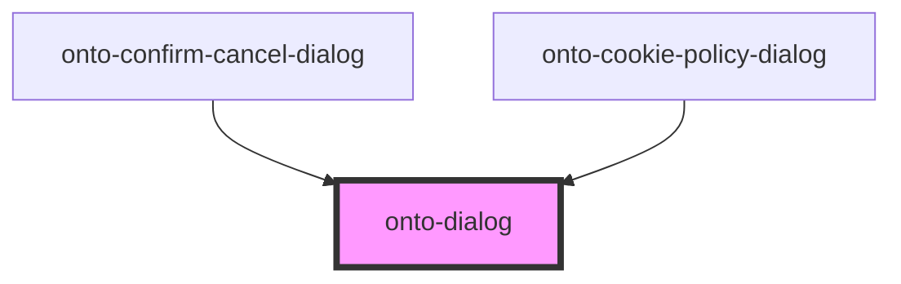

# onto-dialog

<!-- Auto Generated Below -->

## Properties

| Property | Attribute | Description                          | Type                                                                                                  | Default     |
| -------- | --------- | ------------------------------------ | ----------------------------------------------------------------------------------------------------- | ----------- |
| `config` | --        | Configuration object for the dialog. | `{ dialogTitle: string; onClose?: (evt: KeyboardEvent \| MouseEvent) => void; modalClass?: string; }` | `undefined` |

## Dependencies

### Used by

 - [onto-confirm-cancel-dialog](onto-confirm-cancel-dialog)
 - [onto-cookie-policy-dialog](onto-cookie-policy-dialog)

### Graph

```mermaid
graph TD;
  onto-confirm-cancel-dialog --> onto-dialog
  onto-cookie-policy-dialog --> onto-dialog
  style onto-dialog fill:#f9f,stroke:#333,stroke-width:4px
```

----------------------------------------------

*Built with [StencilJS](https://stenciljs.com/)*
