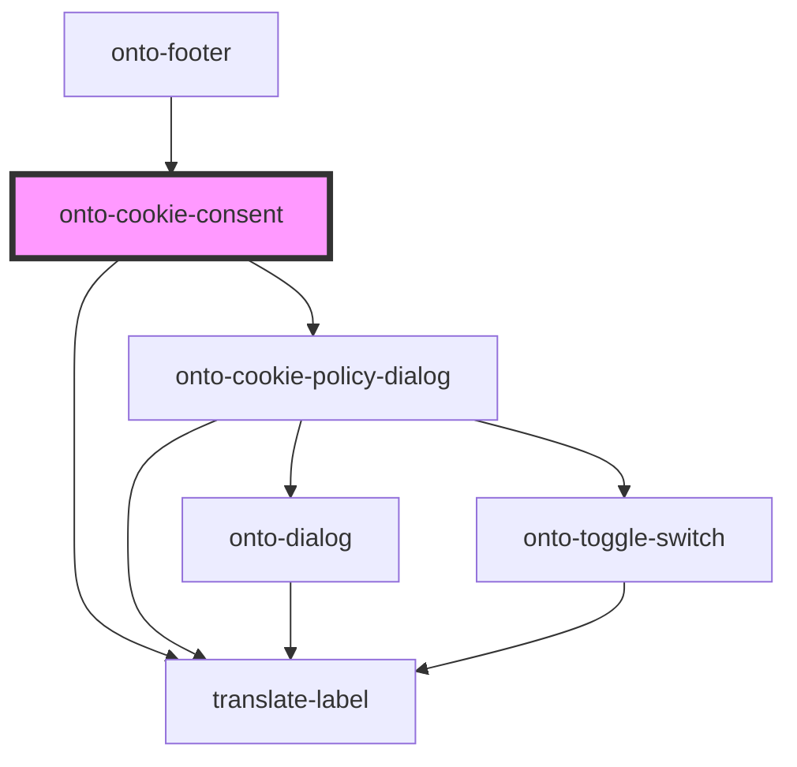

# onto-cookie-consent

<!-- Auto Generated Below -->

## Overview

OntoCookieConsent component for handling cookie consent functionality.
This component displays a cookie consent modal and manages the visibility of a cookie policy dialog.

## Events

| Event          | Description                             | Type                |
| -------------- | --------------------------------------- | ------------------- |
| `consentGiven` | Event emitter for when consent is given | `CustomEvent<void>` |

## Dependencies

### Used by

 - [onto-footer](../onto-footer)

### Depends on

- [translate-label](../translate-label)
- [onto-cookie-policy-dialog](../dialogs/onto-cookie-policy-dialog)

### Graph

----------------------------------------------

*Built with [StencilJS](https://stenciljs.com/)*
