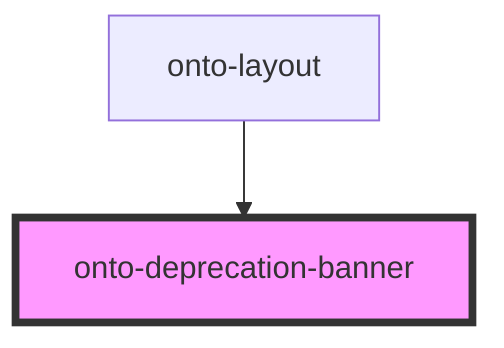

# deprecation-banner

<!-- Auto Generated Below -->

## Events

| Event         | Description                        | Type                |
| ------------- | ---------------------------------- | ------------------- |
| `closeBanner` | Emitted when the banner is closed. | `CustomEvent<void>` |

## Dependencies

### Used by

 - [onto-layout](../onto-layout)

### Graph

----------------------------------------------

*Built with [StencilJS](https://stenciljs.com/)*
