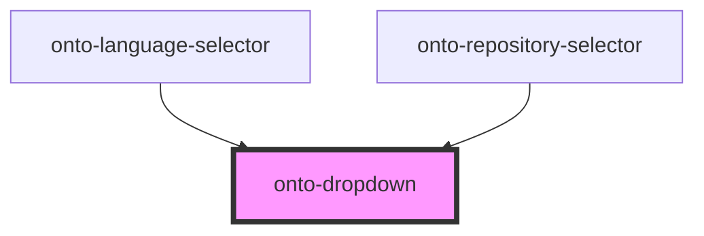

# onto-dropdown

<!-- Auto Generated Below -->

## Overview

A reusable dropdown component built using StencilJS. This component supports configurable labels, tooltips, icons,
and items, making it versatile for various use cases. It also integrates with a translation service to handle
internationalization.

## Properties

| Property                        | Attribute                           | Description                                                                                                                                                                                                                                                             | Type                                                        | Default                      |
| ------------------------------- | ----------------------------------- | ----------------------------------------------------------------------------------------------------------------------------------------------------------------------------------------------------------------------------------------------------------------------- | ----------------------------------------------------------- | ---------------------------- |
| `dropdownAlignment`             | `dropdown-alignment`                | Specifies the dropdown items' alignment. If not provided, the items and the dropdown button will be aligned to the left.                                                                                                                                                | `DropdownItemAlignment.LEFT \| DropdownItemAlignment.RIGHT` | `DropdownItemAlignment.LEFT` |
| `dropdownButtonName`            | `dropdown-button-name`              | The name for the dropdown button. This can either be a string (used directly as the button label) or a Stencil component (used to render the button content). It will be used if present; otherwise, the {@link OntoDropdown#dropdownButtonNameLabelKey } will be used. | `string`                                                    | `undefined`                  |
| `dropdownButtonNameLabelKey`    | `dropdown-button-name-label-key`    | The translation label key for the dropdown button name. It will be used if {@link OntoDropdown#dropdownButtonName } is not present.                                                                                                                                     | `string`                                                    | `undefined`                  |
| `dropdownButtonTooltip`         | `dropdown-button-tooltip`           | The dropdown button tooltip. It will be used if present; otherwise, the {@link OntoDropdown#dropdownButtonTooltipLabelKey } will be used.                                                                                                                               | `string`                                                    | `undefined`                  |
| `dropdownButtonTooltipLabelKey` | `dropdown-button-tooltip-label-key` | The translation label key for the dropdown button tooltip. It will be used if {@link OntoDropdown#dropdownButtonTooltip } is not present.                                                                                                                               | `string`                                                    | `undefined`                  |
| `iconClass`                     | `icon-class`                        | Icon class for the main dropdown button.                                                                                                                                                                                                                                | `string`                                                    | `''`                         |
| `items`                         | --                                  | Array of dropdown options.                                                                                                                                                                                                                                              | `DropdownItem<any>[]`                                       | `undefined`                  |

## Events

| Event          | Description                                                                                                | Type               |
| -------------- | ---------------------------------------------------------------------------------------------------------- | ------------------ |
| `valueChanged` | Event emitted when a dropdown item is selected. The event payload contains the value of the selected item. | `CustomEvent<any>` |

## Dependencies

### Used by

 - [onto-language-selector](../onto-language-selector)
 - [onto-repository-selector](../onto-repository-selector)

### Graph

----------------------------------------------

*Built with [StencilJS](https://stenciljs.com/)*
