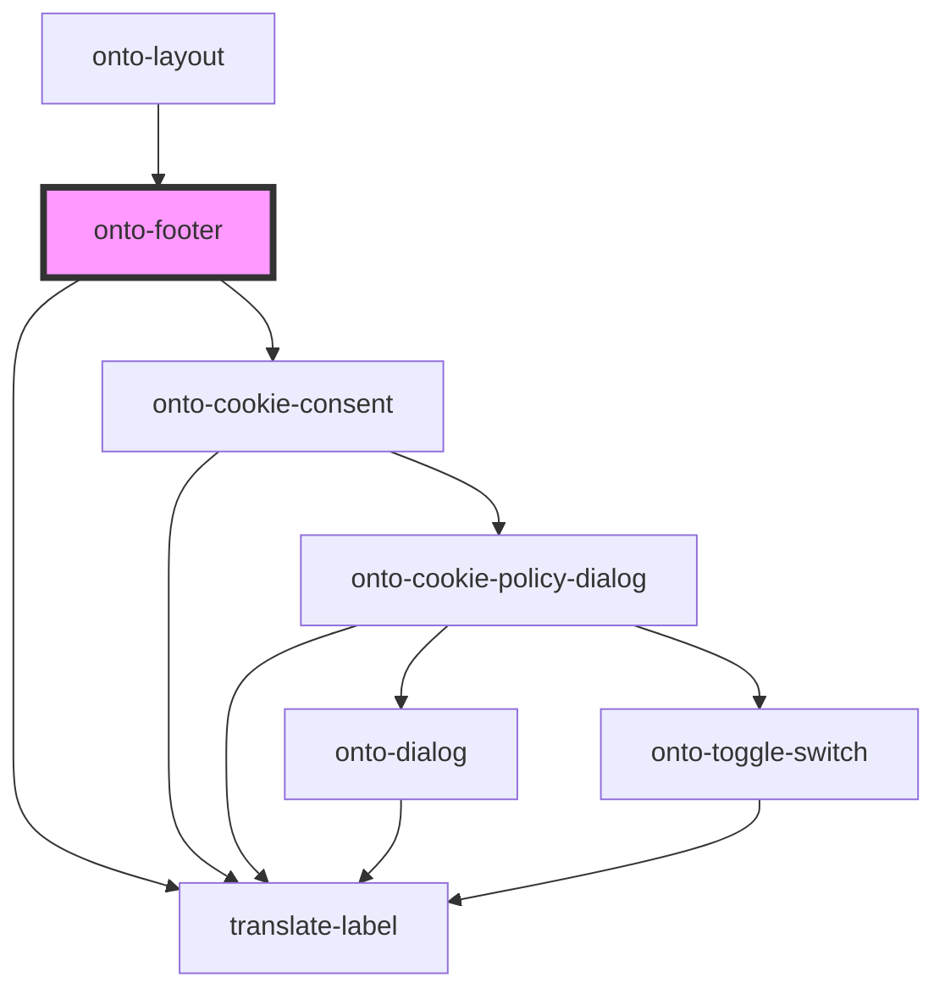

# onto-footer

<!-- Auto Generated Below -->

## Overview

OntoFooter component for rendering the footer of the application.
This component displays information about GraphDB, RDF4J, Connectors, and Workbench versions,
as well as copyright information.

## Dependencies

### Used by

 - [onto-layout](../onto-layout)

### Depends on

- [translate-label](../translate-label)
- [onto-cookie-consent](../onto-cookie-consent)

### Graph

----------------------------------------------

*Built with [StencilJS](https://stenciljs.com/)*
