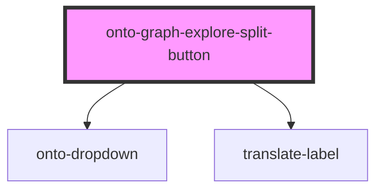

# onto-graph-explore-split-button

<!-- Auto Generated Below -->

## Overview

Split button component for exploring graphs based on available configurations.

The component loads graph configurations, presents them as dropdown items, and emits a {@link GraphExploreEvent}
when the primary button is clicked or a specific configuration is selected.

## Properties

| Property            | Attribute             | Description                                                                 | Type                             | Default     |
| ------------------- | --------------------- | --------------------------------------------------------------------------- | -------------------------------- | ----------- |
| `fetchGraphConfigs` | `fetch-graph-configs` | Callback invoked when the dropdown is opened to fetch graph configurations. | `() => Promise<GraphConfigList>` | `undefined` |
| `label`             | `label`               | Label displayed on the primary action button.                               | `string`                         | `undefined` |

## Events

| Event          | Description                                                                                                                                                                                                                                                                                                         | Type                                                                      |
| -------------- | ------------------------------------------------------------------------------------------------------------------------------------------------------------------------------------------------------------------------------------------------------------------------------------------------------------------- | ------------------------------------------------------------------------- |
| `graphExplore` | Emitted when the user triggers a graph exploration action.  - `action: 'default' - when the main button is clicked. - `action: 'select' - when a dropdown menu item is selected. - `action: 'create' - when the create graph link is clicked.  `graphConfig` is provided when a specific configuration is selected. | `CustomEvent<{ action: GraphExploreAction; graphConfig?: GraphConfig; }>` |

## Dependencies

### Depends on

- [onto-dropdown](../onto-dropdown)
- [translate-label](../translate-label)

### Graph

----------------------------------------------

*Built with [StencilJS](https://stenciljs.com/)*
