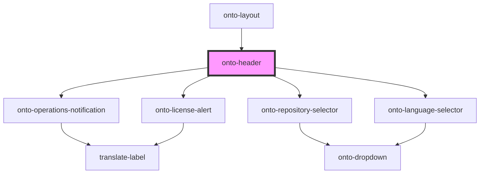

# onto-header

<!-- Auto Generated Below -->

## Overview

OntoHeader component for rendering the header of the application.
This component includes a search component, license alert (if applicable),
repository selector, and language selector.

## Dependencies

### Used by

 - [onto-layout](../onto-layout)

### Depends on

- [onto-operations-notification](../onto-operations-notification)
- [onto-license-alert](../onto-license-alert)
- [onto-repository-selector](../onto-repository-selector)
- [onto-language-selector](../onto-language-selector)

### Graph

----------------------------------------------

*Built with [StencilJS](https://stenciljs.com/)*
