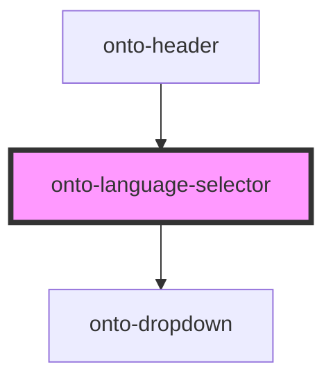

# onto-language-selector

<!-- Auto Generated Below -->

## Properties

| Property            | Attribute            | Description                                                                                                              | Type                                                        | Default                      |
| ------------------- | -------------------- | ------------------------------------------------------------------------------------------------------------------------ | ----------------------------------------------------------- | ---------------------------- |
| `dropdownAlignment` | `dropdown-alignment` | Specifies the dropdown items' alignment. If not provided, the items and the dropdown button will be aligned to the left. | `DropdownItemAlignment.LEFT \| DropdownItemAlignment.RIGHT` | `DropdownItemAlignment.LEFT` |

## Dependencies

### Used by

 - [onto-header](../onto-header)

### Depends on

- [onto-dropdown](../onto-dropdown)

### Graph

----------------------------------------------

*Built with [StencilJS](https://stenciljs.com/)*
