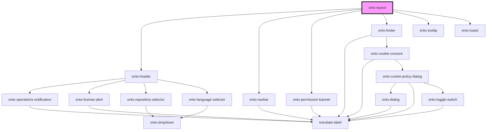

# onto-layout

<!-- Auto Generated Below -->

## Dependencies

### Depends on

- [onto-header](../onto-header)
- [onto-navbar](../onto-navbar)
- [onto-permission-banner](../onto-permission-banner)
- [onto-footer](../onto-footer)
- [onto-tooltip](../onto-tooltip)
- [onto-toastr](../onto-toastr)

### Graph

----------------------------------------------

*Built with [StencilJS](https://stenciljs.com/)*
