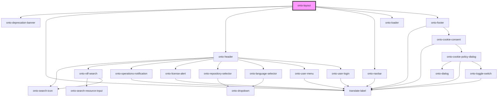

# onto-layout

<!-- Auto Generated Below -->

## Dependencies

### Depends on

- [onto-deprecation-banner](../onto-deprecation-banner)
- [translate-label](../translate-label)
- [onto-header](../onto-header)
- [onto-navbar](../onto-navbar)
- [onto-loader](../onto-loader)
- [onto-footer](../onto-footer)

### Graph

```mermaid
graph TD;
  onto-layout --> onto-deprecation-banner
  onto-layout --> translate-label
  onto-layout --> onto-header
  onto-layout --> onto-navbar
  onto-layout --> onto-loader
  onto-layout --> onto-footer
  onto-header --> onto-search-icon
  onto-header --> onto-rdf-search
  onto-header --> onto-operations-notification
  onto-header --> onto-license-alert
  onto-header --> onto-repository-selector
  onto-header --> onto-language-selector
  onto-header --> onto-user-menu
  onto-header --> onto-user-login
  onto-rdf-search --> onto-search-resource-input
  onto-rdf-search --> onto-search-icon
  onto-operations-notification --> translate-label
  onto-license-alert --> translate-label
  onto-repository-selector --> onto-dropdown
  onto-language-selector --> onto-dropdown
  onto-user-menu --> translate-label
  onto-user-login --> translate-label
  onto-navbar --> translate-label
  onto-footer --> translate-label
  onto-footer --> onto-cookie-consent
  onto-cookie-consent --> translate-label
  onto-cookie-consent --> onto-cookie-policy-dialog
  onto-cookie-policy-dialog --> onto-dialog
  onto-cookie-policy-dialog --> translate-label
  onto-cookie-policy-dialog --> onto-toggle-switch
  onto-toggle-switch --> translate-label
  style onto-layout fill:#f9f,stroke:#333,stroke-width:4px
```

----------------------------------------------

*Built with [StencilJS](https://stenciljs.com/)*
