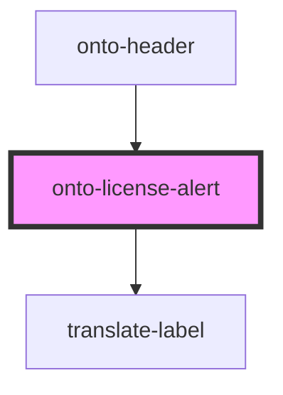

# onto-license-alert

<!-- Auto Generated Below -->

## Properties

| Property  | Attribute | Description                     | Type      | Default     |
| --------- | --------- | ------------------------------- | --------- | ----------- |
| `license` | `license` | The current license information | `License` | `undefined` |

## Dependencies

### Used by

 - [onto-header](../onto-header)

### Depends on

- [translate-label](../translate-label)

### Graph

----------------------------------------------

*Built with [StencilJS](https://stenciljs.com/)*
