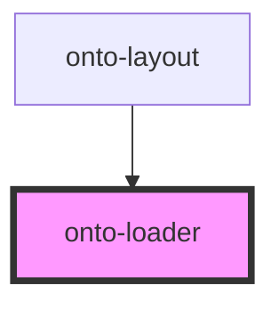

# onto-loader

<!-- Auto Generated Below -->

## Properties

| Property      | Attribute      | Description                                        | Type     | Default |
| ------------- | -------------- | -------------------------------------------------- | -------- | ------- |
| `messageText` | `message-text` | Optional message text to display below the loader. | `string` | `''`    |
| `size`        | `size`         | Size of the loader in pixels (width and height).   | `number` | `100`   |

## Dependencies

### Used by

 - [onto-layout](../onto-layout)

### Graph

----------------------------------------------

*Built with [StencilJS](https://stenciljs.com/)*
