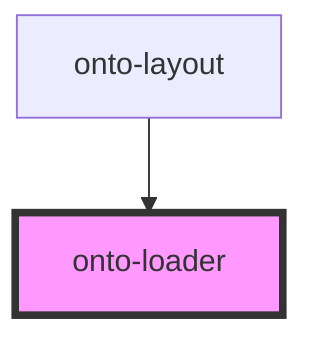

# onto-loader

<!-- Auto Generated Below -->

## Properties

| Property         | Attribute         | Description                                                                  | Type      | Default |
| ---------------- | ----------------- | ---------------------------------------------------------------------------- | --------- | ------- |
| `loading`        | `loading`         | Whether the loader is currently active and should be displayed.              | `boolean` | `false` |
| `messageText`    | `message-text`    | Optional message text to display below the loader.                           | `string`  | `''`    |
| `size`           | `size`            | Size of the loader in pixels (width and height).                             | `number`  | `100`   |
| `targetSelector` | `target-selector` | CSS selector of a DOM element to attach the loader to as a centered overlay. | `string`  | `''`    |

## Dependencies

### Used by

 - [onto-layout](../onto-layout)

### Graph

```mermaid
graph TD;
  onto-layout --> onto-loader
  style onto-loader fill:#f9f,stroke:#333,stroke-width:4px
```

----------------------------------------------

*Built with [StencilJS](https://stenciljs.com/)*
