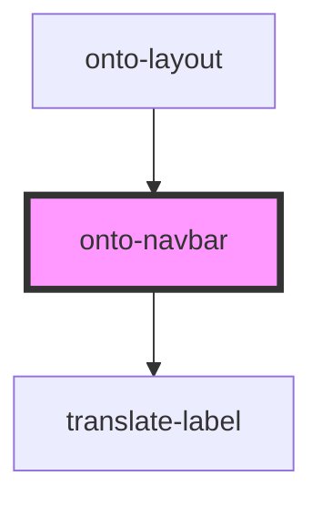

# onto-navbar

<!-- Auto Generated Below -->

## Properties

| Property          | Attribute          | Description                                                                                                  | Type                       | Default     |
| ----------------- | ------------------ | ------------------------------------------------------------------------------------------------------------ | -------------------------- | ----------- |
| `menuItems`       | --                 | Configuration for the menu items model. This is the external model that is used to build the internal model. | `ExternalMenuItemsModel[]` | `undefined` |
| `navbarCollapsed` | `navbar-collapsed` | Configuration whether the navbar should be collapsed.                                                        | `boolean`                  | `undefined` |
| `selectedMenu`    | `selected-menu`    | The selected menu item.                                                                                      | `string`                   | `undefined` |

## Events

| Event           | Description                             | Type                              |
| --------------- | --------------------------------------- | --------------------------------- |
| `navbarToggled` | Event fired when the navbar is toggled. | `CustomEvent<NavbarToggledEvent>` |

## Dependencies

### Used by

 - [onto-layout](../onto-layout)

### Depends on

- [translate-label](../translate-label)

### Graph

----------------------------------------------

*Built with [StencilJS](https://stenciljs.com/)*
