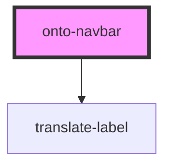

# onto-navbar

<!-- Auto Generated Below -->

## Properties

| Property    | Attribute | Description | Type                       | Default     |
| ----------- | --------- | ----------- | -------------------------- | ----------- |
| `menuItems` | --        |             | `ExternalMenuItemsModel[]` | `undefined` |

## Dependencies

### Depends on

- [translate-label](../translate-label)

### Graph

----------------------------------------------

*Built with [StencilJS](https://stenciljs.com/)*
