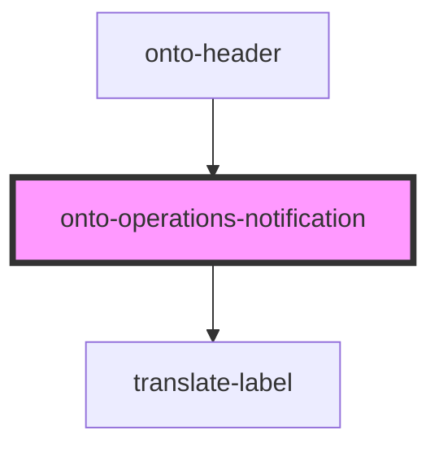

# onto-operations-notification

<!-- Auto Generated Below -->

## Properties

| Property           | Attribute | Description                                                                    | Type                     | Default     |
| ------------------ | --------- | ------------------------------------------------------------------------------ | ------------------------ | ----------- |
| `activeOperations` | --        | The active operations summary. Holds general status and all current operations | `OperationStatusSummary` | `undefined` |

## Dependencies

### Used by

 - [onto-header](../onto-header)

### Depends on

- [translate-label](../translate-label)

### Graph

----------------------------------------------

*Built with [StencilJS](https://stenciljs.com/)*
