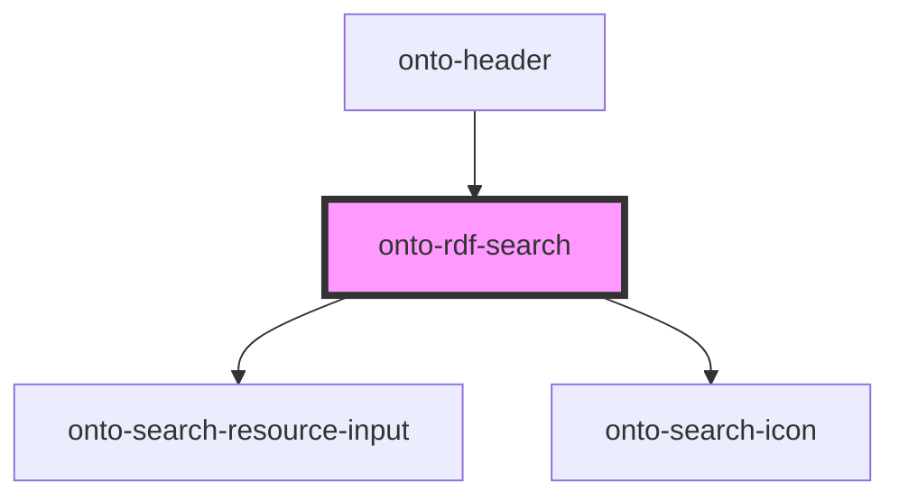

# onto-rdf-search

<!-- Auto Generated Below -->

## Overview

OntoRdfSearch component for RDF resource search.
This component is responsible for showing/hiding the search menu in the header

## Dependencies

### Used by

 - [onto-header](../onto-header)

### Depends on

- [onto-search-resource-input](../onto-search-resource-input)
- [onto-search-icon](../onto-search-icon)

### Graph

----------------------------------------------

*Built with [StencilJS](https://stenciljs.com/)*
