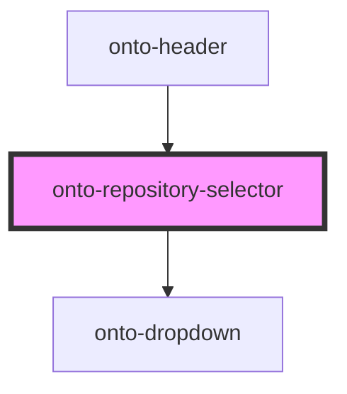

# onto-repository-selector

<!-- Auto Generated Below -->

## Properties

| Property                    | Attribute                      | Description                                                             | Type                                                | Default     |
| --------------------------- | ------------------------------ | ----------------------------------------------------------------------- | --------------------------------------------------- | ----------- |
| `canWriteRepo`              | `can-write-repo`               | Determines whether the current user has write access to the repository. | `(repo: Repository) => boolean`                     | `undefined` |
| `currentRepository`         | `current-repository`           | The currently selected repository.                                      | `Repository`                                        | `undefined` |
| `expansionRatioFormatter`   | `expansion-ratio-formatter`    | Formatter for numeric values with fraction in tooltips.                 | `NumberFormat`                                      | `undefined` |
| `items`                     | `items`                        | The list of repositories to show in the dropdown.                       | `DropdownItem<Repository>[]`                        | `undefined` |
| `repositorySizeInfoFetcher` | `repository-size-info-fetcher` | Fetches repository size info used to build tooltips.                    | `(repo: Repository) => Promise<RepositorySizeInfo>` | `undefined` |
| `totalTripletsFormatter`    | `total-triplets-formatter`     | Formatter for numeric values in tooltips.                               | `NumberFormat`                                      | `undefined` |

## Dependencies

### Used by

 - [onto-header](../onto-header)

### Depends on

- [onto-dropdown](../onto-dropdown)

### Graph

----------------------------------------------

*Built with [StencilJS](https://stenciljs.com/)*
