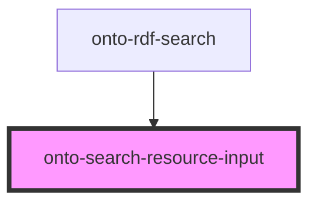

# onto-search-resource-input

<!-- Auto Generated Below -->

## Overview

A component for rendering RDF search resource input with configurable buttons.
This component provides a text input for search queries and a set of configurable buttons.

## Properties

| Property         | Attribute         | Description                                                                                                                                                                                                                                                 | Type                 | Default     |
| ---------------- | ----------------- | ----------------------------------------------------------------------------------------------------------------------------------------------------------------------------------------------------------------------------------------------------------- | -------------------- | ----------- |
| `buttonConfig`   | --                | Button configuration for the search resource input. Holds buttons to be displayed, as well as additional configuration, such as whether the buttons should be treated as radio buttons.                                                                     | `SearchButtonConfig` | `undefined` |
| `context`        | `context`         | The search resource component can appear more than once per page. This context is used to differentiate them. When a suggestion is selected different parents may need to do different things. The context is emitted alongside the suggestion upon select. | `string`             | `undefined` |
| `isHidden`       | `is-hidden`       | Whether the search component is currently hidden. Can be shown/hidden in the RDF search                                                                                                                                                                     | `boolean`            | `false`     |
| `preserveSearch` | `preserve-search` | Whether to preserve the input value and last selected suggestion If true, both will be stored in local storage and loaded, when the component is rendered                                                                                                   | `boolean`            | `undefined` |
| `skipValidation` | `skip-validation` | Whether the rdf resource pre-search validation should be skipped.                                                                                                                                                                                           | `boolean`            | `false`     |

## Dependencies

### Used by

 - [onto-rdf-search](../onto-rdf-search)

### Graph

----------------------------------------------

*Built with [StencilJS](https://stenciljs.com/)*
