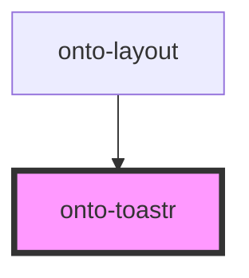

# onto-toastr

<!-- Auto Generated Below -->

## Overview

OntoToastr component for displaying toast notifications.

This component manages a list of toast messages and handles their display,
automatic removal after timeout, and user interactions like hover behavior.

## Dependencies

### Used by

 - [onto-layout](../onto-layout)

### Graph

----------------------------------------------

*Built with [StencilJS](https://stenciljs.com/)*
