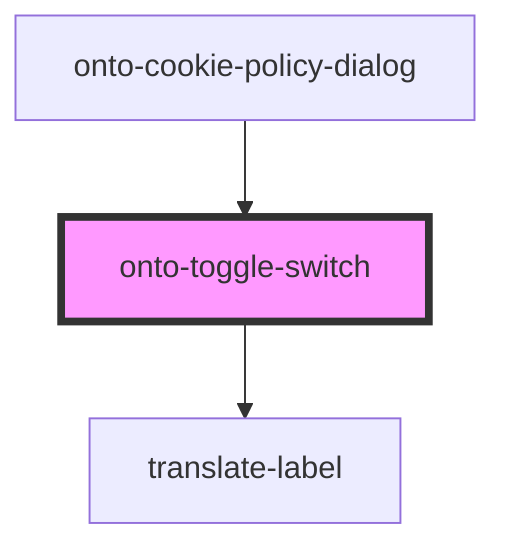

# onto-toggle-switch

<!-- Auto Generated Below -->

## Properties

| Property                | Attribute                 | Description                                                                                                                        | Type      | Default     |
| ----------------------- | ------------------------- | ---------------------------------------------------------------------------------------------------------------------------------- | --------- | ----------- |
| `checked`               | `checked`                 | Determines whether the toggle switch is checked or not.                                                                            | `boolean` | `false`     |
| `context`               | `context`                 | The context for the tooltip, if supplied. This is useful if you have multiple toggle switches, to know which one is being toggled. | `string`  | `undefined` |
| `labelKey`              | `label-key`               | The key used for translating the label text, if supplied.                                                                          | `string`  | `undefined` |
| `tooltipTranslationKey` | `tooltip-translation-key` | The translation label key for the tooltip message, if supplied.                                                                    | `string`  | `undefined` |

## Events

| Event           | Description                                                                       | Type                              |
| --------------- | --------------------------------------------------------------------------------- | --------------------------------- |
| `toggleChanged` | Event emitted when the toggle switch is clicked, carrying the new checked status. | `CustomEvent<ToggleEventPayload>` |

## Dependencies

### Used by

 - [onto-cookie-policy-dialog](../dialogs/onto-cookie-policy-dialog)

### Depends on

- [translate-label](../translate-label)

### Graph

----------------------------------------------

*Built with [StencilJS](https://stenciljs.com/)*
