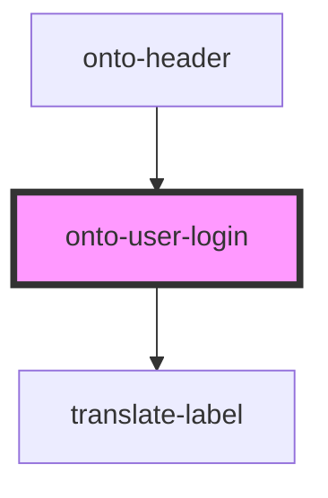

# onto-user-login

<!-- Auto Generated Below -->

## Dependencies

### Used by

 - [onto-header](../onto-header)

### Depends on

- [translate-label](../translate-label)

### Graph

----------------------------------------------

*Built with [StencilJS](https://stenciljs.com/)*
