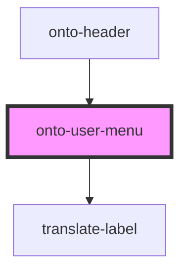

# onto-user-menu

<!-- Auto Generated Below -->

## Overview

This component displays the current user's name and provides options
for navigating to settings and logging out.

## Properties

| Property | Attribute | Description                  | Type                | Default     |
| -------- | --------- | ---------------------------- | ------------------- | ----------- |
| `user`   | --        | Currently authenticated user | `AuthenticatedUser` | `undefined` |

## Dependencies

### Used by

 - [onto-header](../onto-header)

### Depends on

- [translate-label](../translate-label)

### Graph

----------------------------------------------

*Built with [StencilJS](https://stenciljs.com/)*
