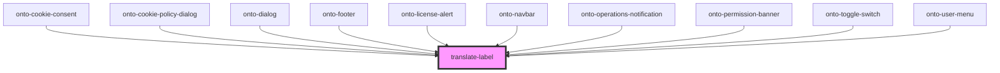

# translate-label

<!-- Auto Generated Below -->

## Overview

The purpose of this component is to display translated literals in the DOM. A Stencil component re-renders when a prop or state changes,
but it may not re-render when the language changes. In such cases, this component should be used. It handles language change events
and re-translates the passed language and translation parameters.
Example of usage:
<code>
   <translate-label labelKey={item.labelKey} translationParameter={item.translationParameter}></translate-label>
   <translate-label labelKey="example.label></translate-label>
</code>

## Properties

| Property                | Attribute   | Description                                    | Type                     | Default     |
| ----------------------- | ----------- | ---------------------------------------------- | ------------------------ | ----------- |
| `labelKey`              | `label-key` | Represents a label key.                        | `string`                 | `undefined` |
| `translationParameters` | --          | Represents an array of translation parameters. | `TranslationParameter[]` | `[]`        |

## Dependencies

### Used by

 - [onto-cookie-consent](../onto-cookie-consent)
 - [onto-cookie-policy-dialog](../dialogs/onto-cookie-policy-dialog)
 - [onto-dialog](../dialogs)
 - [onto-footer](../onto-footer)
 - [onto-license-alert](../onto-license-alert)
 - [onto-navbar](../onto-navbar)
 - [onto-operations-notification](../onto-operations-notification)
 - [onto-permission-banner](../onto-permission-banner)
 - [onto-toggle-switch](../onto-toggle-switch)
 - [onto-user-menu](../onto-user-menu)

### Graph

----------------------------------------------

*Built with [StencilJS](https://stenciljs.com/)*
